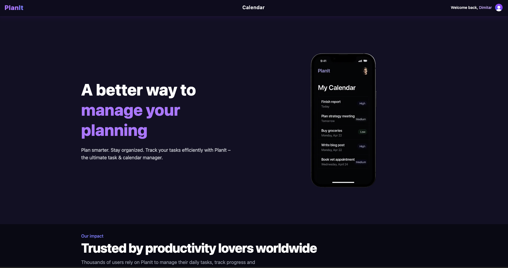
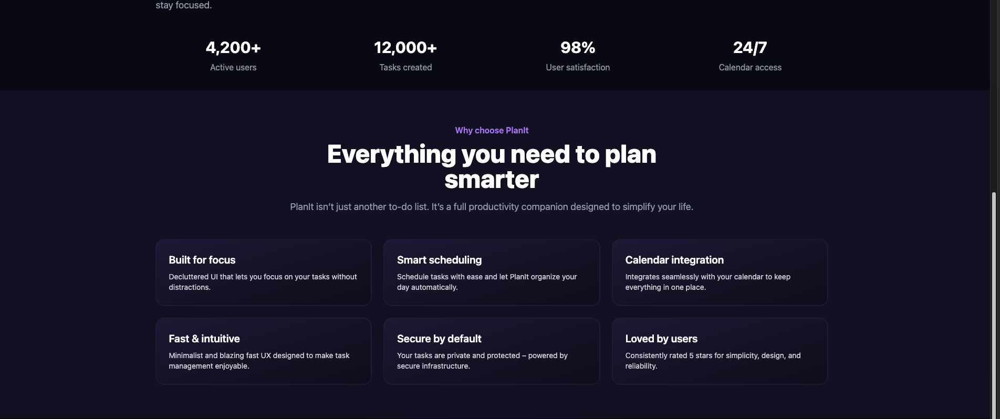
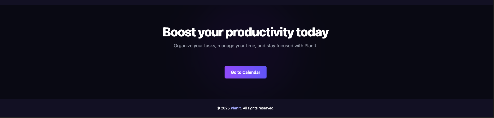
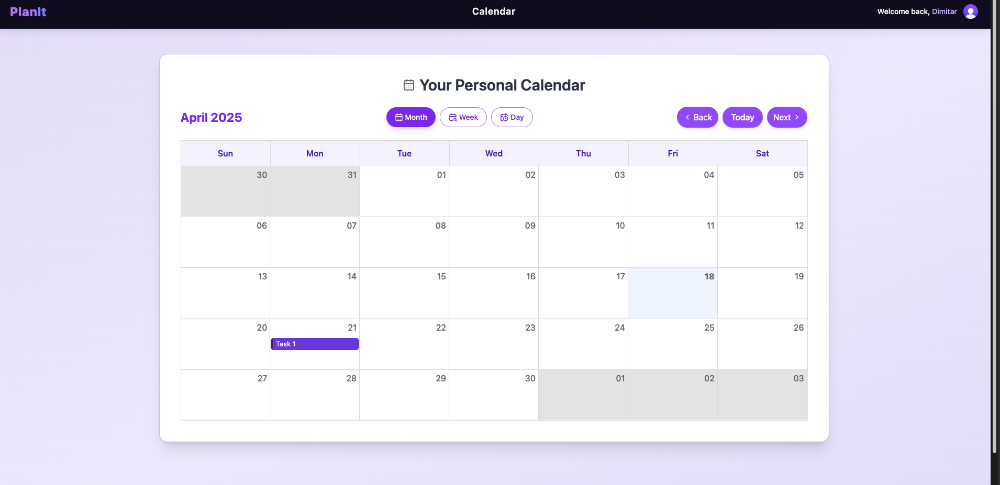

# 📅 PlanIt – A Simple Calendar & Task App

**PlanIt** is a basic application built to explore the capabilities of **Next.js**. This is my first project using Next.js, created primarily for learning purposes and not intended for production use.

---

## 🔧 Technologies Used

- **Next.js** – Framework for server-rendered React applications
- **Clerk** – Authentication solution
- **PostgreSQL** – Database (hosted via Railway)
- **Prisma ORM** – Database toolkit
- **Tailwind CSS** – Utility-first CSS framework
- **React Big Calendar** – Calendar component
- **React Toastify** – Notifications library

---

## 🚀 Features

- 📅 Add and view tasks in a calendar
- 🔒 Secure user authentication
- 🗄️ Store and fetch tasks from a database
- 📱 Fully responsive design for mobile and desktop
- 🔔 In-app notifications
- ✏️ Task creation and deletion
- 🌐 Basic SEO setup with `sitemap.xml` and `robots.txt`

---

## 💻 Running Locally

Follow these steps to set up the project locally:

1. **Clone the repository**:

   ```bash
   git clone https://github.com/YOUR_USERNAME/planit.git
   cd planit
   ```

2. **Install dependencies**:

   ```bash
   npm install
   ```

3. **Add a `.env` file** with your environment variables:

   ```env
   DATABASE_URL=...
   NEXT_PUBLIC_CLERK_PUBLISHABLE_KEY=...
   CLERK_SECRET_KEY=...
   ```

4. **Generate the Prisma client**:

   ```bash
   npx prisma generate
   ```

5. **Start the development server**:

   ```bash
   npm run dev
   ```

---

## 🖼️ Screenshots

### 🏠 Home Page





### 📅 Calendar View



---

## 📝 Note

This is a learning project and not a production-ready solution. It helped me understand how to integrate Next.js, databases, authentication, and frontend components in a real-world context.
